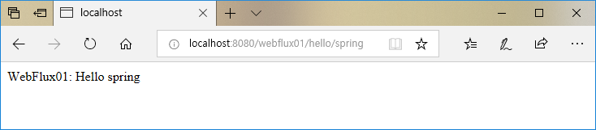
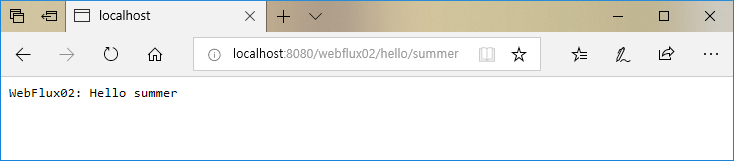
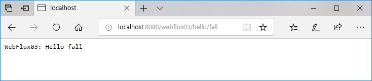

:toc:
:numbered:

= Spring WebFlux

== WebFlux 는 무엇인가?

.Keywork
* Async
* NonBlocking
* Reactive

제가 스피드웨건도 아니고, 초급임으로 자세한 설명은 생락....

토비님의 스프링캠프 2017 동영상을 참고하세요.

link:https://www.youtube.com/watch?v=HKlUvCv9hvA[스프링캠프 2017: Async & Spring]

link:https://www.youtube.com/watch?v=2E_1yb8iLKk&t=1313s[스프링캠프 2017: Spring Web Flux]

== SpringBoot Project 생성

.기준선
* SpringBoot 2.x
** Spring 5.x
** JDK 8

.의존성
* spring-boot-starter-webflux
* spring-boot-starter-test

.etc
* intellij ultmate
* gradle

== WebFlux 1: MVC Style 로 작성하기

=== Source 코드 작성

WebFlux 는 기존 Spring MVC 스타일을 지원한다고 한다. +
만들어 보자구.

[source, java]
----
package com.example.demo.controller;

import org.springframework.web.bind.annotation.GetMapping;
import org.springframework.web.bind.annotation.PathVariable;
import org.springframework.web.bind.annotation.RestController;

@RestController
public class WebFlux01 {
    @GetMapping("/webflux01/hello/{name}")
    String hello(@PathVariable String name) {
        return "WebFlux01: Hello " + name;
    }
}
----

=== 로그 분석

구동 후 전체 로그는 아래와 같다.

[source, log]
----
  .   ____          _            __ _ _
 /\\ / ___'_ __ _ _(_)_ __  __ _ \ \ \ \
( ( )\___ | '_ | '_| | '_ \/ _` | \ \ \ \
 \\/  ___)| |_)| | | | | || (_| |  ) ) ) )
  '  |____| .__|_| |_|_| |_\__, | / / / /
 =========|_|==============|___/=/_/_/_/
 :: Spring Boot ::        (v2.0.4.RELEASE)

2018-08-29 18:07:54.856  INFO 46667 --- [           main] com.example.demo.DemoApplication         : Starting DemoApplication on gimjongmin-ui-MacBook-Pro.local with PID 46667 (/Users/jmkim/IdeaProjects/demo/out/production/classes started by jmkim in /Users/jmkim/IdeaProjects/demo)
2018-08-29 18:07:54.859  INFO 46667 --- [           main] com.example.demo.DemoApplication         : No active profile set, falling back to default profiles: default
2018-08-29 18:07:54.897  INFO 46667 --- [           main] onfigReactiveWebServerApplicationContext : Refreshing org.springframework.boot.web.reactive.context.AnnotationConfigReactiveWebServerApplicationContext@add0edd: startup date [Wed Aug 29 18:07:54 KST 2018]; root of context hierarchy
2018-08-29 18:07:55.590  INFO 46667 --- [           main] s.w.r.r.m.a.RequestMappingHandlerMapping : Mapped "{[/webflux01/hello/{name}],methods=[GET]}" onto java.lang.String WebFlux01.hello(java.lang.String)
2018-08-29 18:07:55.630  INFO 46667 --- [           main] o.s.w.r.handler.SimpleUrlHandlerMapping  : Mapped URL path [/webjars/**] onto handler of type [class org.springframework.web.reactive.resource.ResourceWebHandler]
2018-08-29 18:07:55.631  INFO 46667 --- [           main] o.s.w.r.handler.SimpleUrlHandlerMapping  : Mapped URL path [/**] onto handler of type [class org.springframework.web.reactive.resource.ResourceWebHandler]
2018-08-29 18:07:55.707  INFO 46667 --- [           main] o.s.w.r.r.m.a.ControllerMethodResolver   : Looking for @ControllerAdvice: org.springframework.boot.web.reactive.context.AnnotationConfigReactiveWebServerApplicationContext@add0edd: startup date [Wed Aug 29 18:07:54 KST 2018]; root of context hierarchy
2018-08-29 18:07:55.965  INFO 46667 --- [           main] o.s.j.e.a.AnnotationMBeanExporter        : Registering beans for JMX exposure on startup
2018-08-29 18:07:56.038  INFO 46667 --- [ctor-http-nio-1] r.ipc.netty.tcp.BlockingNettyContext     : Started HttpServer on /0:0:0:0:0:0:0:0:8080
2018-08-29 18:07:56.039  INFO 46667 --- [           main] o.s.b.web.embedded.netty.NettyWebServer  : Netty started on port(s): 8080
2018-08-29 18:07:56.044  INFO 46667 --- [           main] com.example.demo.DemoApplication         : Started DemoApplication in 1.423 seconds (JVM running for 1.902)
----

로그에서 주목해야 할 부분은 두 군데..

.Mapping 정보
[source, log, subs="verbatim,quotes"]
----
Mapped "{[/webflux01/hello/{name}],methods=[GET]}"
----

.Netty 를 기본 내장 웹서버로 사용
[source, log, subs="verbatim,quotes"]
----
Netty started on port(s): 8080
----

WebFlux 를 사용하는 경우 기본으로 임베디드 톰캣이 아닌 #*임베디드 네티*# 를 사용하게 됩니다. +
#*서블릿 컨테이너가 필요하지 않으니까요!!!*#

=== 브라우저에서 확인

자 이제 브라우저로 접근해 보겠습니다.

=== Test Code

[source, java]
----
package com.example.demo.controller;

// 참고: https://grokonez.com/testing/springboot-webflux-test-webfluxtest

import org.junit.Test;
import org.junit.runner.RunWith;
import org.springframework.beans.factory.annotation.Autowired;
import org.springframework.boot.test.autoconfigure.web.reactive.WebFluxTest;
import org.springframework.http.MediaType;
import org.springframework.test.context.junit4.SpringRunner;
import org.springframework.test.web.reactive.server.WebTestClient;

@RunWith(SpringRunner.class)
@WebFluxTest
public class WebFlux01Test {
    @Autowired
    private WebTestClient webClient;

    @Test
    public void helloTest() throws Exception {
        webClient.get()
                .uri("/webflux01/hello/{name}", "spring")
                .accept(MediaType.APPLICATION_JSON_UTF8)
                .exchange()
                .expectStatus().isOk()
                .expectBody(String.class)
                .isEqualTo("WebFlux01: Hello spring");
    }
}
----

== WebFlux 2: RouterFunction & HandlerFunction 사용하기 1

=== 사전 지식

.RouterFunction
* RestController 대체
* RequestMapping 대체
* @Bean 으로 등록 필요

.HanderFuntion
* Logic 처리

=== Source 코드 작성

[source, java]
----
package com.example.demo.controller;

import org.springframework.context.annotation.Bean;
import org.springframework.context.annotation.Configuration;
import org.springframework.web.reactive.function.server.HandlerFunction;
import org.springframework.web.reactive.function.server.RequestPredicates;
import org.springframework.web.reactive.function.server.RouterFunction;
import org.springframework.web.reactive.function.server.ServerResponse;
import reactor.core.publisher.Mono;

import static org.springframework.web.reactive.function.server.ServerResponse.ok;

@Configuration
public class WebFlux02 {
    HandlerFunction helloHandler = req -> {
        String name = req.pathVariable("name");
        Mono<String> result = Mono.just("WebFlux02: Hello " + name);

        Mono<ServerResponse> res = ok().body(result, String.class);

        return res;
    };

    @Bean
    public RouterFunction<ServerResponse> route() {
        RouterFunction router = req ->
                RequestPredicates.path("/webflux02/hello/{name}").test(req) ? Mono.just(helloHandler) : Mono.empty();

        return router;
    }
}
----

=== 로그 분석

[source, log]
----
2018-08-29 23:55:36.715  INFO 12412 --- [           main] s.w.r.r.m.a.RequestMappingHandlerMapping : Mapped "{[/webflux01/hello/{name}],methods=[GET]}" onto java.lang.String com.example.demo.controller.WebFlux01.hello(java.lang.String)
2018-08-29 23:55:36.811  INFO 12412 --- [           main] o.s.w.r.f.s.s.RouterFunctionMapping      : Mapped com.example.demo.controller.WebFlux02$$Lambda$226/1768882706@7bb6ab3a
----

응? 소스에서 기대했던 [/flux1/hello/{name}] 에 대한 Mapped 정보가 없다는 것이 당황스럽다. +
대신 Mapped com.example.demo.controller.WebFlux02$$Lambda$226/1768882706@7bb6ab3a 가 보일 뿐이다. +
람보둥절??? +

() () +
(9.6;

=== 브라우저에서 확인

잘 된다능... 그런데 Mapped 로그가 영 마음에 안 드는...

=== Test Code

[source, java]
----
package com.example.demo.controller;

import org.junit.Test;
import org.junit.runner.RunWith;
import org.springframework.beans.factory.annotation.Autowired;
import org.springframework.boot.test.autoconfigure.web.reactive.WebFluxTest;
import org.springframework.http.MediaType;
import org.springframework.test.context.junit4.SpringRunner;
import org.springframework.test.web.reactive.server.WebTestClient;

@RunWith(SpringRunner.class)
@WebFluxTest(WebFlux02.class)
public class WebFlux02Test {
    @Autowired
    private WebTestClient webClient;

    @Test
    public void helloTest() throws Exception {
        webClient.get()
                .uri("/webflux02/hello/{name}", "summer")
                .accept(MediaType.APPLICATION_JSON_UTF8)
                .exchange()
                .expectStatus().isOk()
                .expectBody(String.class)
                .isEqualTo("WebFlux02: Hello summer");
    }
}
----

기존 MVC 스타일의 테스트 코드와 약간 달라진 부분이 있다. +
그것을 찾는 건 독자의 몫으로...

@WebFluxTest vs. @WebFluxTest(#WebFlux02.class#)

사실 WebFlux01 의 테스트 코드도 @WebFluxTest([red]#WebFlux01.class#) 처럼 해주는 것이 좋다.

== WebFlux 3: RouterFunction & HandlerFunction 사용하기 2

=== 사전 지식

HandlerFunction 에 간단한 로직만 있다면 그냥 RouterFunction 을 정의하면서 처리하는 것도 나쁘지 않아...

=== Source 코드 작성

[source, java]
----
package com.example.demo.controller;

import org.springframework.context.annotation.Bean;
import org.springframework.context.annotation.Configuration;
import org.springframework.web.reactive.function.server.RequestPredicates;
import org.springframework.web.reactive.function.server.RouterFunction;
import org.springframework.web.reactive.function.server.RouterFunctions;
import org.springframework.web.reactive.function.server.ServerResponse;

import static org.springframework.web.reactive.function.BodyInserters.fromObject;
import static org.springframework.web.reactive.function.server.ServerResponse.ok;

@Configuration
public class WebFlux03 {
    @Bean
    public RouterFunction<ServerResponse> route() {
        return RouterFunctions.route(
                RequestPredicates.path("/webflux03/hello/{name}"),
                req -> ok().body(fromObject("WebFlux03: Hello " + req.pathVariable("name")))
        );
    }
}
----

=== 로그 분석

[source, log]
----
2018-08-30 00:09:46.286  INFO 8412 --- [           main] s.w.r.r.m.a.RequestMappingHandlerMapping : Mapped "{[/webflux01/hello/{name}],methods=[GET]}" onto java.lang.String com.example.demo.controller.WebFlux01.hello(java.lang.String)
2018-08-30 00:09:46.405  INFO 8412 --- [           main] o.s.w.r.f.s.s.RouterFunctionMapping      : Mapped com.example.demo.controller.WebFlux02$$Lambda$226/1814423236@3e14c16d
2018-08-30 00:09:46.406  INFO 8412 --- [           main] o.s.w.r.f.s.s.RouterFunctionMapping      : Mapped /webflux03/hello/{name} -> com.example.demo.controller.WebFlux03$$Lambda$228/472991420@5d1659ea
----

오오.. 이렇게 하니 경로가 나온다.

[source, log]
----
Mapped /webflux03/hello/{name} -> com.example.demo.controller.WebFlux03$$Lambda$228/472991420@5d1659ea
----

아싸~~

=== 브라우저에서 확인

=== Test Code

이전과 동일하겠지.. +
글 작성에 DRY 원칙 적용 ^^; +
(이럴 때는 WET 이 낫긴 한데.. ㅡㅡ;) +
Write Everything Twice

=== 사전 지식
=== Source 코드 작성
=== 로그 분석
=== 브라우저에서 확인
=== Test Code

== TODO

* RouteFunction / HandlerFunction 단위 테스트 세분화
* adoc 문서 분리

[source, java]
----
package com.example.demo.controller;

import org.springframework.context.annotation.Bean;
import org.springframework.context.annotation.Configuration;
import org.springframework.web.bind.annotation.GetMapping;
import org.springframework.web.bind.annotation.PathVariable;
import org.springframework.web.bind.annotation.RestController;
import org.springframework.web.reactive.function.server.*;
import reactor.core.publisher.Mono;

import static org.springframework.web.reactive.function.BodyInserters.fromObject;
import static org.springframework.web.reactive.function.server.RequestPredicates.GET;
import static org.springframework.web.reactive.function.server.ServerResponse.ok;

@RestController
public class MyMVC {
    @GetMapping("/mvc/hello/{name}")
    String hello(@PathVariable String name) {
        return "MVC: Hello " + name;
    }
}

@Configuration
class MyFlux {
    HandlerFunction helloHandler = req -> {
        String name = req.pathVariable("name");
        Mono<String> result = Mono.just("WebFlux 1, 2: Hello " + name);

        Mono<ServerResponse> res = ok().body(result, String.class);

        return res;
    };

    @Bean
    public RouterFunction<ServerResponse> route() {
        RouterFunction router = req ->
            RequestPredicates.path("/flux1/hello/{name}").test(req) ? Mono.just(helloHandler) : Mono.empty();

        return router;
    }

    @Bean
    public RouterFunction<ServerResponse> route2() {
        return req ->
            RequestPredicates.path("/flux2/hello/{name}").test(req) ? Mono.just(helloHandler) : Mono.empty();
    }

    @Bean
    public RouterFunction<ServerResponse> route3() {
        return RouterFunctions.route(
                RequestPredicates.path("/flux3/hello/{name}"),
                req -> ok().body(fromObject("WebFlux 3: Hello " + req.pathVariable("name")))
        );
    }

    HandlerFunction handler2 = req -> {
        String res = "WebFlux 4: Hello " + req.pathVariable("name");
        return ok().body(fromObject(res));
    };

    @Bean
    public RouterFunction<ServerResponse> route4() {
        return RouterFunctions.route(
                RequestPredicates.path("/flux4/hello/{name}"),
                handler2
        );
    }

    @Bean
    public RouterFunction<ServerResponse> route5() {
        return RouterFunctions.route(
                GET("/flux5/hello/{name}"),
                handler2
        );
    }
}
----