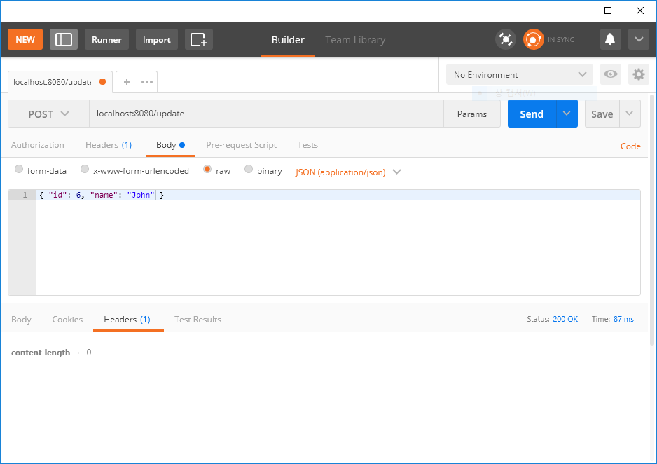

:toc:
:numbered:

= if kakao 2018 토비 WebFlux

link:https://tv.kakao.com/channel/3150758/cliplink/391418995?playlistId=209907&metaObjectType=Playlist[]

link:https://www.slideshare.net/ifkakao/5-113145589[]

== Application001

== Application002

== Application003

== Application004Tests

StepVerifier

== Application005

WebClient

== Application006Tests

MockWebServer

WebClientIntegrationTests 에 유용한 샘플들 참조 요망
link:https://github.com/spring-projects/spring-framework/blob/master/spring-webflux/src/test/java/org/springframework/web/reactive/function/client/WebClientIntegrationTests.java[WebClientIntegrationTests]

ToDo: 36m 00s