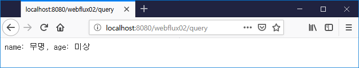
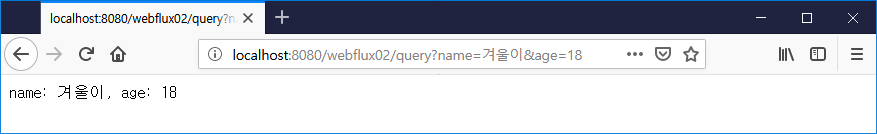

:toc:
:numbered:

= WebFlux 002

== RouteFunction 001: 건드려 보기

기존 패키지 com.heaven.webflux01 밑에 Webflux02 클래스를 생성하고 아래 코드를 타이핑해 보자.

[source.java]
[subs="quotes"]
----
package com.heaven.webflux01;

import org.springframework.context.annotation.Bean;
import org.springframework.stereotype.Component;
import org.springframework.web.reactive.function.server.RouterFunction;
import org.springframework.web.reactive.function.server.RouterFunctions;
import org.springframework.web.reactive.function.server.ServerResponse;

import static org.springframework.web.reactive.function.BodyInserters.fromObject;
import static org.springframework.web.reactive.function.server.RequestPredicates.GET;

@Component
public class Webflux02 {
    @Bean
    RouterFunction<ServerResponse> route001() {
        return RouterFunctions.route(
            GET("/webflux02/hello"),
            req -> ServerResponse.ok().body(fromObject("Hello WebFlux"))
        );
    }
}
----

타이핑이 완료 되었다면 Webflux01Application 을 재실행 해보자.

[source,log]
[subs="quotes"]
----
... : #Mapped (GET && /webflux02/hello)# ...
... : Started HttpServer on /0:0:0:0:0:0:0:0:8080
... : Netty started on port(s): 8080
... : Started Webflux01Application in 11.763 seconds (JVM running for 23.812)
----

기존의 Mapped 에 더해서 GET 방식으로 접근 가능한 /webflux02/hello 라는 경로(Route)가 생겼음을 유의해서 보자. +
이제 웹 브라우저으를 통해 접근해 보자.

소스에서 주목할 부분은 @Controller 또는 @RestController, @GetMapping 등 SpringMVC 에서 사용하던 애너테이션들이 없다는 것이다. 물론 스프링 빈으로 등록하기 위한 @Component, @Bean 은 남았지만...

** 

웹 브라우저가 수신한 내용을 살펴보기 위해 [개발자 도구]를 실행하고 [네트워크] 항목을 살펴 보자.

** 

== RouteFunction 002: 경로 변수(Path Variable) 이용

Webflux02 클래스에 아래 메서드를 추가해 주자.

[source,java]
[subs="quotes"]
----
@Bean
RouterFunction<ServerResponse> route002() {
    return RouterFunctions.route(
        GET("/webflux02/hello/{name}"),
        req -> ServerResponse.ok().body(fromObject("Hello " + #req.pathVariable("name")#))
    );
}
----

프로그램을 재실행하고 로그를 살펴보면 "Mapped (GET && /webflux02/hello/{name})" 추가된 것을 확인할 수 있다. +
웹브라우저에 "http://localhost:8080/webflux02/hello/여름나라 겨울이야기" 를 입력했을 때 응답은 다음 그림과 같다.

** 

== RouteFunction 002: 질의 문자열(Query String) 이용

[sourc,java]
[subs="quotes"]
----
@Bean
RouterFunction<ServerResponse> route003() {
    return RouterFunctions.route(
            GET("/webflux02/query"),
            req -> ServerResponse
                    .ok()
                    .body(
                            fromObject(
                                    String.format(
                                            "name: %s, age: %s",
                                            #req.queryParam("name").orElse("무명")#,
                                            #req.queryParam("age").orElse("미상")#
                                    )
                            )
                    )
    );
}
----

queryParam 메서드가 Optional 을 반환하기 때문에 orElse 처리를 해 주었다.
프로그램을 재실행하고 웹브라우저에 name, age 의 4 가지 조합으로 각각 접속해 보자.

image:images/lesson002/005.PNG[RouteFunction]

위 그림들을 통해 req.queryParam("...") 이 왜 Optional 을 반환하는지 짐작할 수 있기를...

== RouteFunction 003: JSON 정보 이용

[source,java]
[subs="quotes"]
----
    @Bean
    RouterFunction<ServerResponse> route004() {
        return RouterFunctions.route(POST("/webflux02/json"),
            req -> req.body(toMono(User.class))
                .doOnNext(user -> log.info(user.toString()))
                .then(ok().build()));
    }
}
----

JSON 데이터를 POST 로 넘겨서 확인하는 것은 역시 독자의 몫으로...
(HTML 작성, curl, httpie, postman...)

== RouteFunction 004: RouteFunction Chaining

게시판에 대한 Route 를 총괄하는 함수를 만들어 보자.

[source,java]
[subs="quotes"]
----
@Bean
RouterFunction<ServerResponse> route005() {
    return RouterFunctions.route(
            GET("/boards"),
            req -> ok().body(fromObject("GET /boards")))
        .andRoute(
            GET("/boards/{num}"),
            req -> ok().body(fromObject("GET /boards/" + req.pathVariable("num"))))
        .andRoute(
            POST("/boards"),
            req -> req.body(toMono(Board.class))
                .doOnNext(board -> log.info(board.toString()))
                .then(ok().build()))
        .andRoute(
            PUT("/boards"),
            req -> req.body(toMono(Board.class))
                .doOnNext(board -> log.info(board.toString()))
                .then(ok().build()))
        .andRoute(
            DELETE("/boards/{num}"),
            req -> ok().body(fromObject("DELETE /board/" + req.pathVariable("num"))));
}
----

* GET /boards 호출

* GET /boards/{num} 호출

* POST /boards 호출

* PUT /boards 호출

* DELETE /boards/{num} 호출
image:images/lesson002/016.PNG[RouteFunction]