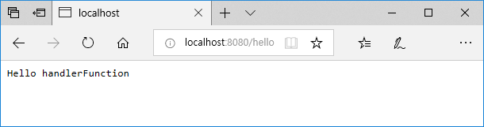

:toc:
:numbered:

= WebFlux 003

== Handler Function 001: 건드려 보기

새로운 ReactiveWeb 프로젝트를 생성하고 아래와 같은 클래스를 추가하도록 하자.

[source,java]
[subs="quotes"]
----
package com.heaven.webflux02;

import lombok.extern.slf4j.Slf4j;
import org.springframework.context.annotation.Bean;
import org.springframework.stereotype.Component;
import org.springframework.web.reactive.function.server.HandlerFunction;
import org.springframework.web.reactive.function.server.RouterFunction;
import org.springframework.web.reactive.function.server.RouterFunctions;
import org.springframework.web.reactive.function.server.ServerResponse;
import reactor.core.publisher.Mono;

import static org.springframework.web.reactive.function.server.RequestPredicates.GET;
import static org.springframework.web.reactive.function.server.ServerResponse.ok;

@Slf4j
@Component
public class RouteFunction01 {
    @Bean
    RouterFunction<ServerResponse> route001() {
        #HandlerFunction helloHandlerFunction = req -> {#
            #Mono<String> result = Mono.just("Hello handlerFunction");#
            #Mono<ServerResponse> res = ok().body(result, String.class);#
            #return res;#
        #};#

        return RouterFunctions.route(GET("/hello"), #helloHandlerFunction#);
    }
}
----

RouterFunction.java 를 찾아 route 메서드의 시그니처를 살펴보면 아래와 같다.

[source,java]
[subs="quotes"]
----
public static <T extends ServerResponse> RouterFunction<T> route(
        RequestPredicate predicate, HandlerFunction<T> handlerFunction) {

    return new DefaultRouterFunction<>(predicate, handlerFunction);
}
----

작성한 소스와 비교해서 살펴보자.

[cols="1,4"]
|====
|GET("/hello")|RequestPredicate predicate
|helloHandlerFunction|HandlerFunction<T> handlerFunction
|====

HandlerFunction 의 경우는 무척이나 간결하니 확인해 보자.

[source,java]
[subs="quotes"]
----
package org.springframework.web.reactive.function.server;

import reactor.core.publisher.Mono;

@FunctionalInterface
public interface HandlerFunction<T extends ServerResponse> {
	Mono<T> handle(ServerRequest request);
}
----

여기서 주목할 점은 소스를 파고 또 파고 들어가도 Servlet 은 없다는 것이다. +
따라서 Servlet Engine(Tomcat...) 도 필요없다. +
단순히 Servlet 제약이 없는 ServerRequest, ServerResponse 만 있을 뿐이다. +
그래서 단순 Web Server 인 Netty 에서도 웹 요청과 응답을 프로그래밍하여 주고 받을 수 있는 것이다.

지난 시간 Board 에 대한 Rest RouteHandler 를 구현해 보았었는데 거기에 HandlerFunction 을 적용해 보자. +
별도의 Repository 를 구현하지 않았음으로 List 로 대신 작성했다.

[source,java]
[subs="quotes"]
----
package com.heaven.webflux02;

import lombok.AllArgsConstructor;
import lombok.Data;
import lombok.NoArgsConstructor;
import lombok.extern.slf4j.Slf4j;
import org.springframework.context.annotation.Bean;
import org.springframework.stereotype.Component;
import org.springframework.web.reactive.function.server.HandlerFunction;
import org.springframework.web.reactive.function.server.RouterFunction;
import org.springframework.web.reactive.function.server.RouterFunctions;
import org.springframework.web.reactive.function.server.ServerResponse;
import reactor.core.publisher.Flux;
import reactor.core.publisher.Mono;

import java.net.URI;
import java.util.ArrayList;
import java.util.List;

import static org.springframework.web.reactive.function.BodyExtractors.toMono;
import static org.springframework.web.reactive.function.server.RequestPredicates.*;
import static org.springframework.web.reactive.function.server.ServerResponse.*;

@Slf4j
@Component
public class RouteFunction02 {
    @Bean
    RouterFunction<ServerResponse> route() {
        BoardHandler boardHandler = new BoardHandler();

        return RouterFunctions.route(GET("/boards"), boardHandler.list)
                .andRoute(POST("/boards"), boardHandler.create)
                .andRoute(GET("/boards/{num}"), boardHandler.read)
                .andRoute(PUT("/boards/{num}"), boardHandler.update)
                .andRoute(DELETE("/boards/{num}"), boardHandler.delete);
    }
}

@Data
@NoArgsConstructor
@AllArgsConstructor
class Board {
    private int num;
    private String title;
    private String content;
}

class BoardHandler {
    // List.of 는 JAVA 9 이상
    List<Board> boards;
    int num;

    {
        boards = new ArrayList<>();

        for(num = 1; num < 11; num++) {
            boards.add(new Board(num, "제목 " + num, "내용 " + num));
        }
    }

    HandlerFunction list = req -> {
        Flux<Board> result = Flux.fromIterable(boards);
        Mono<ServerResponse> res = ok().body(result, Board.class);
        return res;
    };

    HandlerFunction create = req -> {
        URI uri = null;

        try {
            uri = new URI("/boards");
        } catch (java.net.URISyntaxException ex) {

        }

        return req.body(toMono(Board.class))
                .doOnNext(board -> {
                    board.setNum(num++);
                    boards.add(board);
                })
                .then(created(uri).build());
    };

    HandlerFunction read = req -> {
        int num = Integer.valueOf(req.pathVariable("num"));

        Board foundBoard = null;

        for(Board board : boards) {
            if(board.getNum() == num) {
                foundBoard = board;
                break;
            }
        }

        Mono<ServerResponse> res;

        if(foundBoard == null) {
            res = notFound().build();
        } else {
            res = ok().body(Mono.just(foundBoard), Board.class);
        }

        return res;
    };

    HandlerFunction update = req -> {
        int num = Integer.valueOf(req.pathVariable("num"));

        return req.bodyToMono(Board.class)
                .doOnNext(updatedBoard -> {
                    for(Board board : boards) {
                        if(board.getNum() == num) {
                            if(updatedBoard.getTitle() != null) board.setTitle(updatedBoard.getTitle());
                            if(updatedBoard.getContent() != null) board.setContent(updatedBoard.getTitle());
                            break;
                        }
                    }
                }).then(noContent().build());
    };

    HandlerFunction delete = req -> {
        int num = Integer.valueOf(req.pathVariable("num"));

        for(Board board : boards) {
            if(board.getNum() == num) {
                boards.remove(board);
                break;
            }
        }

        Mono<ServerResponse> res = noContent().build();

        return res;
    };
}
----

POST MAN 등을 통해 확인해 보자.